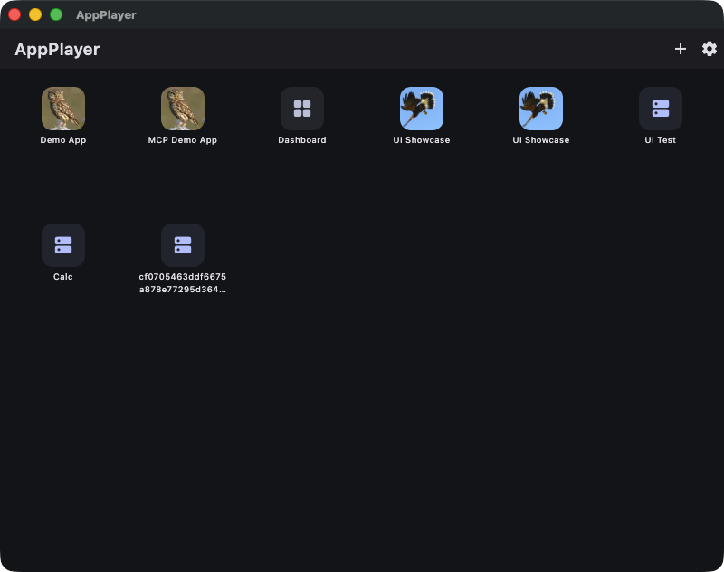
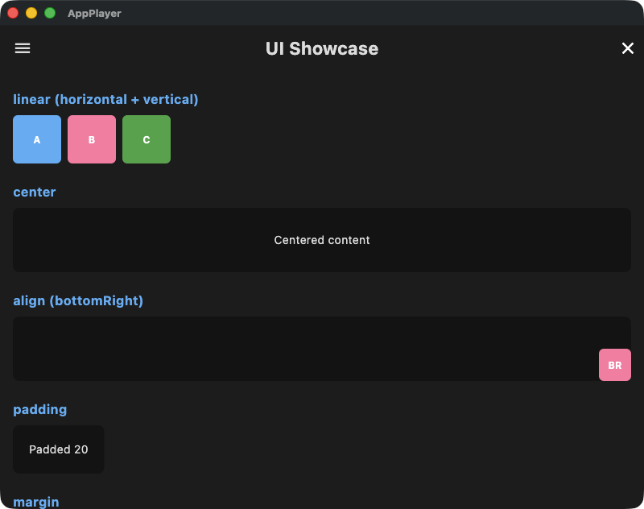
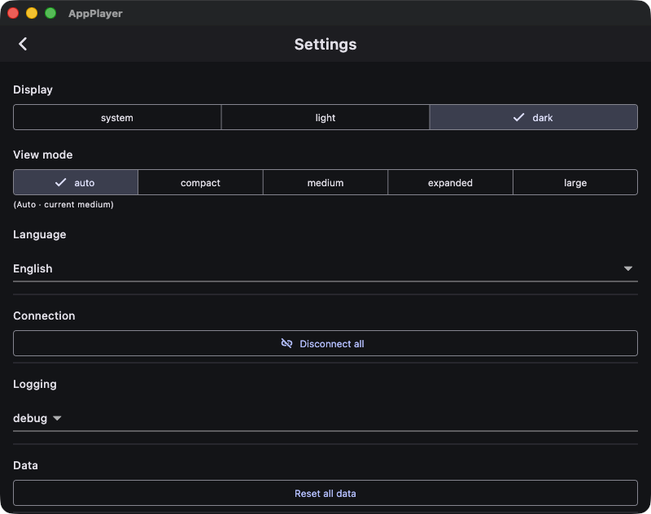

# appplayer

Open-source reference Flutter app for the AppPlayer Standard tier. Renders MCP UI bundles via [`appplayer_core`](https://pub.dev/packages/appplayer_core).

This app is the entry-point reference implementation: a base launcher and runtime that connects to MCP servers, installs and runs bundles, and renders dynamic UI definitions. Pro / X / Custom tiers are layered on top of the same `appplayer_core` library and are not part of this repository.

## Screenshots

| Launcher | Rendered bundle | Settings |
|---|---|---|
|  |  |  |

- **Launcher** — installed apps (local bundles, connected servers, BLE boards) surface as tiles; system apps (App Store, dashboard, settings) sit alongside.
- **Rendered bundle** — an MCP UI DSL bundle (`UI Showcase`) drawn by the runtime: linear/center/align/padding/margin layout primitives, live from the bundle definition.
- **Settings** — theme (system/light/dark), responsive view mode, language (English default + ko/ja/zh), connection management, and log level.

## Features

- **MCP server connection** — attach to an MCP server (streamable HTTP / stdio) and install or run its bundles.
- **Bundle install & run** — `.mcpb` archives and `.mbd` directories install into the launcher and render on open (metadata-only install, UI on first open).
- **Dynamic UI rendering** — MCP UI DSL definitions render through `appplayer_core`'s runtime (layout, widgets, channels, tool calls).
- **BLE board connection** — connect directly to a nearby ESP32 (or other) MCP-over-BLE board. Wires the vendored `ble_transport` recipe (extension-transport standard layer ②) onto `appplayer_core`'s `connectExtensionTransport` seam via `connectBleBoard(...)`.
- **Theme-inherit window chrome** — the native title bar (macOS) and mobile status/nav bars follow the launcher's brightness (light/dark/system).
- **Localization** — English default with Korean / Japanese / Chinese translations.

## Source layout

- `lib/main.dart` — app entry
- `lib/app/` — `MaterialApp` root and composition root
- `lib/adapters/` — host adapters for `appplayer_core` (secure storage, HTTP bundle fetcher, shared-prefs server store, logger, metadata sink)
  - `lib/adapters/ble_extension.dart` — `connectBleBoard(...)`, the app-layer BLE entry
  - `lib/adapters/ble_transport/` — vendored `ble_transport` recipe (BLE GATT board scan + client transport, `specs/platform/16-ble-transport.md`)
- `lib/ui/` — Standard tier screens (home, app renderer, dashboard, settings, onboarding, app form)
- `lib/widgets/` — shared widgets
- `lib/models/` — local data models (e.g. `AppConfig`)
- `lib/l10n/` — i18n string table (English default, with Korean / Japanese / Chinese translations)

Platform folders (`ios/`, `android/`, `macos/`, `linux/`, `windows/`, `web/`) are generated by `flutter create`. The bundle identifier prefix is `com.example.appplayer` — production distributions should override this.

## Build

```bash
flutter pub get
flutter run -d <device>
```

Common targets:

```bash
flutter run -d macos
flutter run -d chrome
flutter build apk
flutter build ios --release
```

## Test

```bash
flutter test
```

## Debug MCP (development)

On desktop, a settings-gated debug MCP endpoint (`ui.screenshot` / `ui.tree` /
`ui.tap` / `ui.type`) can be enabled from **Settings → Debug MCP**. It listens
on port **7931** (Standard; Pro uses 7930) so both tiers can run on one machine.
Use it to drive and inspect the live UI from an MCP client during development.

## Localization

The i18n table lives at `lib/l10n/app_strings.dart` with `en` (default), `ko`, `ja`, and `zh` entries. Use `S.get('key')` for any user-facing string; do not hardcode locale-specific text in screens.

## License

MIT — see [LICENSE](LICENSE).
